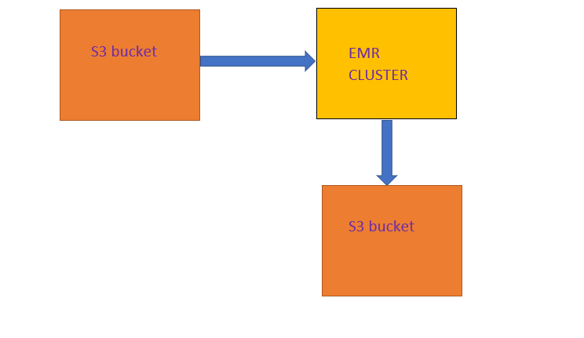

# Pipeline_s3_to_Reshift_cluster
------------------------------------------------
### Overview 
* To use the [Million-song-dataset](https://aws.amazon.com/datasets/million-song-dataset/) and transform into ***STAR-SCHEME*** using ***AWS S3 & EMR***

* #### Technolgies used 
   
   - **Python**
   - **Pyspark sql**
   - **Pyspark rdd**
   - **AWS (S3, EMR)**
   - **Boto3 API**
   
| |
| :--: |
 
### Dataset
  * link to [dataset](https://aws.amazon.com/datasets/million-song-dataset/) which describes details instructions to snapshot dataset into EC2 machine
  * Load the data into S3 bucket, In my case I loaded the data into **mm-music-data** bucket, the dataset is around 
  
* **NOTE:-** Dataset is around ***200 gb***  which is beyond aws free tier limits 
  
### Implementation steps
  *  Data is loaded into ***S3*** and Data modelling design is performed on ***EMR CLUSTER*** Spark 2.4.5
  *  Before spinning up EMR cluster we need to add dependencies Shell file in the s3 bucket in my case ***download_files.sh***
  *  In final step we need to add the shell file to ***Bootstrap Actions*** on EMR cluster and add perform step Execution to run spark-application and spin up the cluster 
  
